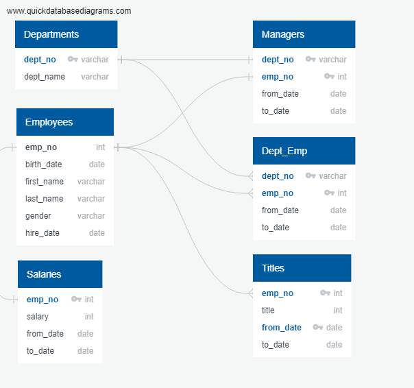
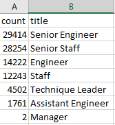
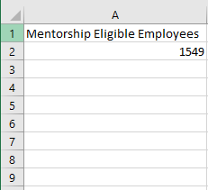

# Pewlett Hackard Employee Analysis

## Overview

The firm Pewlett Hackard tasked Bobby and us to help analyze the employee database through PostgreSQL. The firm wants to properly analyze the amount of soon-to-be retiring employees per title of their job, and then identify employees who would be eligible to engage in a mentorship program. As we take a look at the large number of retiring employees, we realize they are part of the baby boomer generation as the majority of reitirng employees were born in the early 60s. Our task is to help Bobby's manager be prepared for this upcoming "silver tsunami" of retiring employees.

## Results

Upon analysis of the employee database, we identify key components through SQL analysis while examining relationships highlighted in the table below;

1. The analysis identifies 57,668 employees retiring over the age of 60 (senior staff).
2. We see that 29,414 employees alone are Senior Engineers and for a technology company, this is a key area that should be stressed and focused on as a large number of experienced technical workers are leaving.
3. 14,222 other employees also have the title of "Engineer" and are also leaving the company soon.
4. Upon analysis of trying to see who would be eligible for the proposed mentorship program, we see there are only 1,549 eligible employees, a far cry from the thousands more retiring.

## Summary

1. According to the analysis, the total number of retiring employees via SQL is 90,398. It is a substantial portion of the Pewlett Hackard firm.
2. Despite the large number of people retiring, there are a handful (1,549) employees that are qualified to be mentors under the proposed program.

